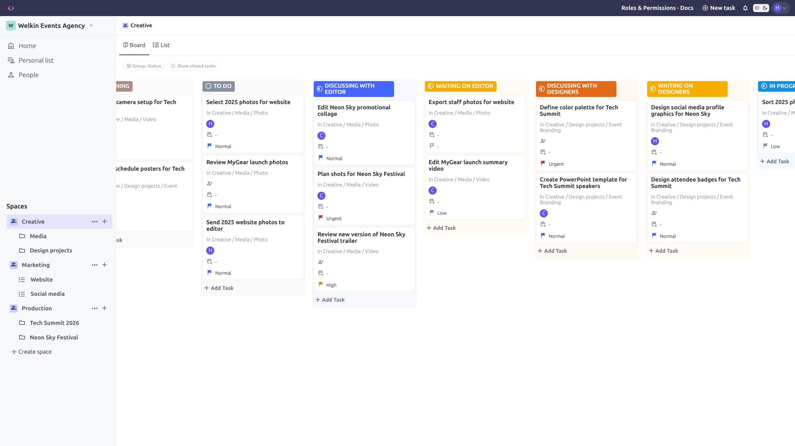

# TeamUp Client

TeamUp is a full-stack work management app based on the design and main features of ClickUp. This repository contains the Angular client.

- Live demo: https://teamup.fran-caballero.dev
- API: https://teamup-api.fran-caballero.dev
- Portfolio case study: [English](https://fran-caballero.dev/en/teamup) / [Español](https://fran-caballero.dev/teamup)
- Backend repo: https://github.com/fran-caballero/teamup-server/

## Preview

<p align="center">
  <a href="docs/images/teamup-creative-space.png">
    
  </a>
</p>

## Overview

TeamUp recreates ClickUp’s visual style and core work-management workflows, including nested Workspaces, Spaces, Folders, Lists and Tasks, board and list views, task assignment and a hierarchical permissions system.

This repository contains the Angular frontend for the app. It handles workspace state management, hierarchy navigation, centralised task grouping, permissions-aware UI behaviour and Socket.IO notifications.

## Features

- Workspace hierarchy: Workspaces, Spaces, Folders, Lists and Tasks
- Board and List task views
- Grouping by status, priority, due date and assignee
- Personal List, My Work and Assigned to me views
- Workspace invitations and member management
- Granular role and permission UI
- Real-time invitation and demo reset notifications with Socket.IO
- Rich task descriptions with Quill
- Demo account and quick user creation flows

## Tech Stack

- Angular 19
- TypeScript
- Angular Material / CDK
- Socket.IO client
- ngx-quill / Quill
- Playwright
- GitHub Actions

## Architecture

The app follows a `core / features / shared` structure:

- `core`: app shell, layout, guards, interceptors, auth, workspace services, socket service
- `features`: route-level product areas such as Home, Space, Folder, List, People, Auth, Roles & Permissions and Task Full View
- `shared`: reusable components, modals, menus, buttons, pipes, utilities, constants and shared types

Key frontend patterns:

- Route guards validate authentication and prevent invalid Space, Folder, List or Task routes from rendering
- HTTP interceptors centralise auth and logging behaviour
- Workspace data is managed through a central service
- Nested entities are exposed through lookup maps for efficient UI access
- Task grouping is centralised in a shared service
- Some create, update and delete flows use optimistic UI updates with rollback behaviour

## End-to-End Testing

The Playwright suite covers four core user journeys:

- Protected routes redirect anonymous users to login
- Authentication persists after a full page reload
- Tasks can be created, updated, reopened and deleted
- Users can navigate the workspace hierarchy and switch between Board and List views

Authenticated scenarios reuse saved browser state, while generated task data is unique and automatically cleaned up after each run.

Install Chromium and run the complete suite with:

```bash
npx playwright install chromium
npm run e2e
```

## Continuous Integration

GitHub Actions runs the complete Playwright suite in Chromium for every pull request targeting `main` and every push to `main`. The pipeline performs a clean dependency installation, starts the Angular application, executes the tests, saves an HTML report and captures traces on retry for diagnostics.

## Getting Started

### Prerequisites

- Node.js
- npm
- Angular CLI, optional

### Install

```bash
npm install
```

### Run locally

```bash
npm start
```

The app runs at:

```text
http://localhost:4200
```

By default, the development environment points to the deployed API:

```ts
apiUrl: "https://teamup-api.fran-caballero.dev";
```

If running a local backend, update `src/environments/environment.development.ts`.

## Demo Access

The live app includes two testing options:

- Use the demo account button on the login page
- Create a quick user without an email address

Creating multiple quick users is useful for testing invitations, permissions and task assignment.

## Project Status

This is a portfolio project built to recreate a recognisable collaborative work-management app from scratch. It is not affiliated with ClickUp.
